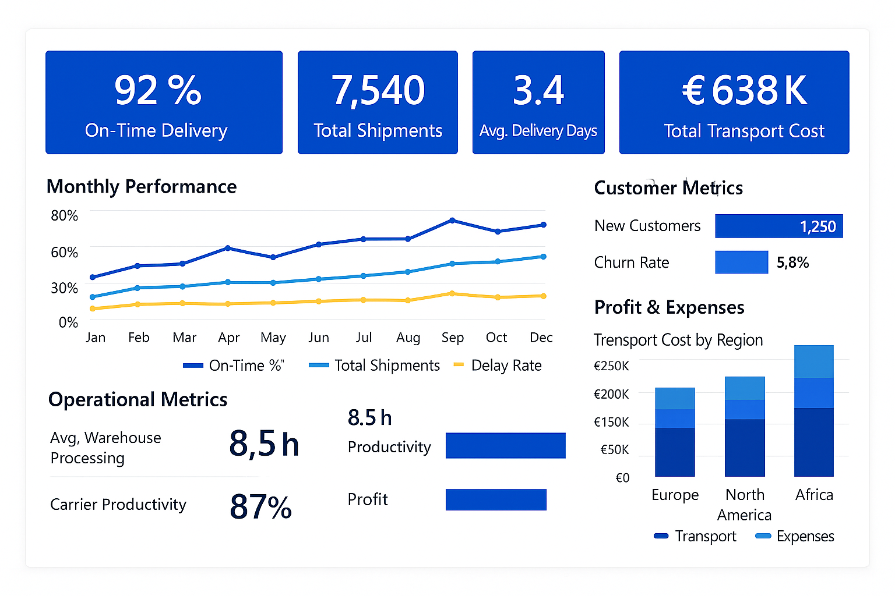

# 📦 Supply Chain KPI Dashboard — Power BI

This dashboard tracks supply chain performance across cost, delivery efficiency, and labor productivity to support decision-making in logistics operations.

---

## 🎯 Project Objectives

- Improve on-time deliveries and reduce delays
- Monitor logistics costs and profitability
- Track workforce productivity and service efficiency
- Provide operational visibility to managers and analysts

---

## ⭐ Key Performance Indicators (KPIs)

| KPI | What it Measures | Business Value |
|-----|------------------|----------------|
| On-Time Delivery % | Shipments delivered as planned | Customer satisfaction |
| Delay Rate % | Late shipments | SLA monitoring |
| Cost per Shipment | Total cost efficiency | Profitability |
| Productivity Index | Workforce throughput | Resource performance |

---

## 📊 Dashboard Preview

> *(Dashboard screenshot automatically displays once uploaded — visible above ✓)*

---

## 🛠 Tools & Skills Used

- Power BI (DAX, Data Modeling, Visualization)
- Excel for initial data analysis
- Supply Chain and Logistics KPI analytics
- Data storytelling for decision support

---

## 🔍 Data Summary

Dataset includes:
- Delivery region & status
- Costs and performance metrics
- Employee productivity scoring

Supporting business questions:
- Which regions face the most delays?
- What is the trend in cost efficiency?
- How productive is the workforce over time?

---

## 📌 Insights

- On-time delivery rate improving YoY → stronger performance
- Delays concentrated in **Europe & Africa** → risk areas
- Logistics costs trending upward → opportunity for vendor negotiation
- Employee productivity stable → capacity for growth

---

## 🚀 Future Enhancements

- Automated reporting updates
- Route optimization insights
- Additional workforce KPIs

---

## 📫 Contact

📧 **Email:** georgeohe6@gmail.com

---

Thank you for viewing this project! More BI and Supply Chain analytics coming soon 🚚📊
